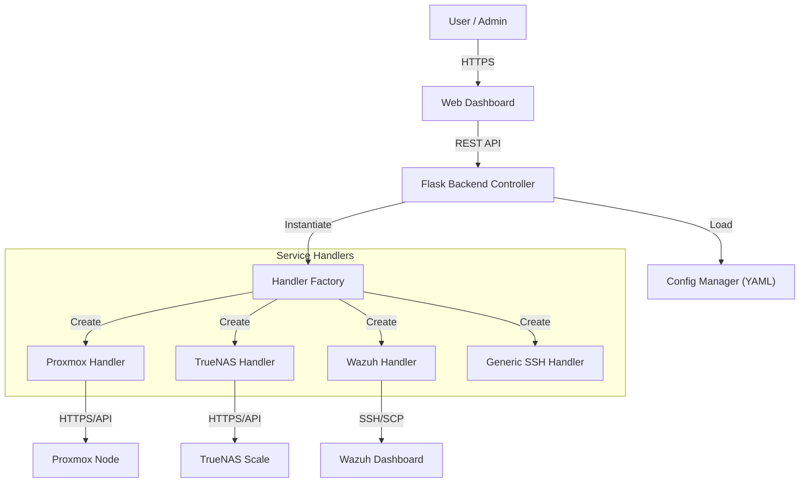
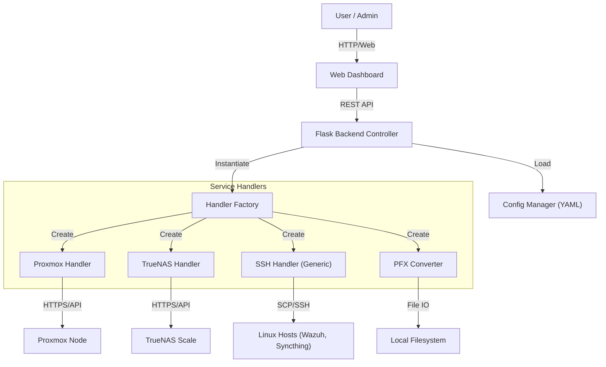

# System Architecture - Certificate Automation Tool

**Version**: 1.1.3
**Date**: 2026-01-27
**Author**: Systems Architecture Team

## 1. High-Level Design
The system follows a **Controller-Adapter** pattern encapsulated within a **Dockerized** Flask application.

## 2. Technology Stack
- **Runtime**: Python 3.11 (Slim Bookworm)
- **Web Framework**: Flask (Gunicorn WSGI)
- **Frontend**: HTML5, Vanilla JS, CSS3 (Cyber Vault Theme)
- **Cryptography**: `cryptography` (Python Lib) - AES-256
- **Transport**: `requests` (HTTP/S), `paramiko` (SSH/SCP)

## 3. Core Modules
1.  **`CertManager`**: Orchestration engine.
2.  **`ConfigManager`**: Dynamic configuration and encryption handling.
3.  **`CertificateHandler`**: Abstract Interface for service adapters.

## 4. Security Considerations
-   **Encrypted Storage**: 
    -   Credentials in `config.yaml` (Fernet AES-128).
    -   Private Keys (`privkey.enc`) (AES-256).
-   **Least Privilege**: Container runs as `appuser` (UID 1000).
-   **Hardening**:
    -   Debug artifacts removed.
    -   Dependencies pinned.
    -   Glassmorphism UI with Visual Security Indicators ("System Locked").

## 5. Deployment
- **Docker First**: Deployment is managed purely via Docker images (`<DOCKER_HUB_USER>/cert-automator`).
- **Persistence**: Usage of Docker Volumes for `/certs`, `/backups`, and `/config`.

**Version**: 1.0  
**Date**: 2026-01-02  
**Author**: Systems Architecture Team

## 1. High-Level Design
The system follows a **Controller-Adapter** pattern encapsulated within a **Dockerized** Flask application.

## 2. Technology Stack
- **Runtime**: Python 3.11 (Slim Docker Image)
- **Web Framework**: Flask (Lightweight, robust)
- **Frontend**: HTML5, Vanilla JS, CSS3 (Glassmorphism design)
- **Cryptography**: `openssl` (CLI) and `cryptography` (Python lib)
- **Transport**: `requests` (HTTP/S), `paramiko` (SSH/SCP)

## 3. Core Modules
1.  **`CertManager`**: The orchestration engine. Validates inputs, loads config, and iterates through defined services.
2.  **`ConfigManager`**: Parses `config.yaml`. Allows for dynamic service definitions without code changes.
3.  **`CertificateHandler` (Interface)**: Abstract Base Class ensuring all handlers implement a standardized `renew(cert, key)` method.
    - **Polymorphism**: The controller does not need to know *how* a service renews, only that it *can*.

## 4. Security Considerations
-   **Encrypted Storage**: 
    -   Credentials in `config.yaml` are encrypted at rest using Fernet symmetric encryption (AES-128).
    -   **Private Keys**: Private keys (`privkey.pem`) are stored as **AES-256 encrypted blobs** (`privkey.enc`) on disk. They are transparently decrypted only in memory during renewal or inspection.
-   **Least Privilege**: The container runs as a non-root user (`appuser`, UID 1000) to minimize attack surface.
- **Production Hardened**: Uses Gunicorn (WSGI) interface and strict input validation to prevent directory traversal attacks.
- **SSH Keys**: Uses standard RSA keys for SSH access, avoiding password usage where possible.
- **TLS Verification**: Defaults to strict checking, but permits `verify=False` for self-hosted intranet services.

## 5. Deployment & Build Pipeline
- **Dev/Prod Parity**: The `dev` folder is the source of truth.
- **Packaging**: A custom Python build script (`build.py`) acts as the CI/CD engine:
    1.  Increments Build ID.
    2.  Snapshots code to `code_backup/` (Uncompressed for easy diffing).
    3.  Sanitizes (removes temp files) and deploys to `prod/`.
- **Docker**: Single `Dockerfile` supports both Dev and Prod, driven by volume mounts.

## 6. Scalability
- **Adding new services**: Requires writing a single Python class inheriting from `CertificateHandler` and adding one line to the factory dict. No UI changes needed (UI is data-driven).
