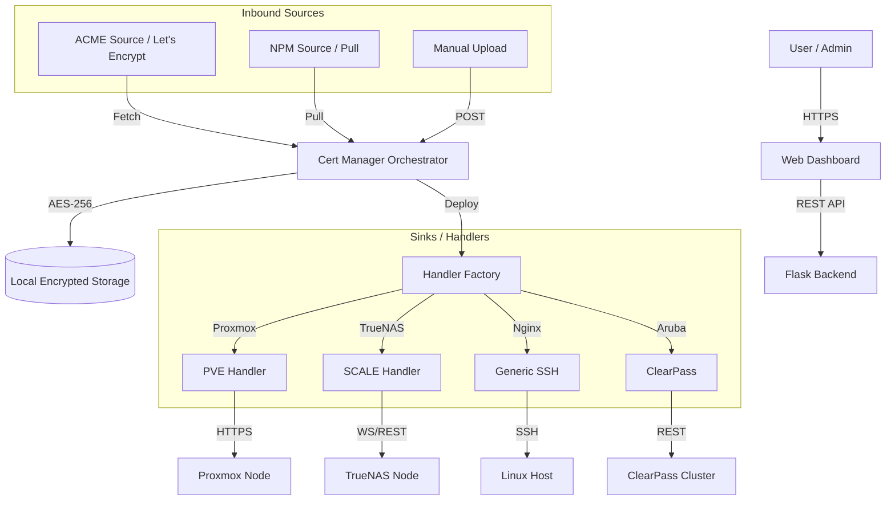

# System Architecture - CertAutomator

**Version**: 1.2.0
**Date**: 2026-03-08
**Author**: Systems Architecture Team

## 1. High-Level Design
CertAutomator 1.2.0 introduces a modular **Source-Storage-Sink** architecture to handle the full lifecycle of SSL/TLS certificates.

```mermaid
graph TD
    User[User / Admin] -->|HTTPS| WebUI[Web Dashboard]
    WebUI -->|REST API| Flask[Flask Backend]
    
    subgraph Inbound Sources
    ACME[ACME Source / Let's Encrypt]
    NPM[NPM Source / Pull]
    UPLOAD[Manual Upload]
    end
    
    ACME -->|Fetch| Manager[Cert Manager Orchestrator]
    NPM -->|Pull| Manager
    UPLOAD -->|POST| Manager
    
    Manager -->|AES-256| Storage[(Local Encrypted Storage)]
    
    Manager -->|Deploy| Factory[Handler Factory]
    
    subgraph Sinks / Handlers
    Factory -->|Proxmox| H1[PVE Handler]
    Factory -->|TrueNAS| H2[SCALE Handler]
    Factory -->|Nginx| H3[Generic SSH]
    Factory -->|Aruba| H4[ClearPass]
    end
    
    H1 -->|HTTPS| Ext1[Proxmox Node]
    H2 -->|WS/REST| Ext2[TrueNAS Node]
    H3 -->|SSH| Ext3[Linux Host]
    H4 -->|REST| Ext4[ClearPass Cluster]
```

## 2. Technology Stack
- **Runtime**: Python 3.13 (Slim Bookworm)
- **Web Framework**: Flask 3.x (Gunicorn WSGI)
- **Security**: 
    - `cryptography` (AES-256 for Keys, Fernet AES-128 for Config)
    - PBKDF2HMAC (100,000 iterations for key derivation)
- **Transport**: 
    - `requests` (HTTP/S with mandatory timeouts)
    - `paramiko` (SSH/SCP)
    - `websocket-client` (TrueNAS SCALE JSON-RPC)
    - `acme` (Python ACME v2 Protocol)

## 3. Core Logic Flow (v1.2.0)
1.  **Orchestration**: `CertManager` triggers a periodic pulse.
2.  **Collection**: Sources (ACME, NPM) check for updated certificates upstream.
3.  **Deduplication**: The system compares the Serial Number/SHA256 of the new certificate against the current one in `/certs`.
4.  **Injection**: If different, the certificate and key are encrypted and saved to disk.
5.  **Distribution**: The system iterates through all enabled services and executes the corresponding `Handler`.

## 4. Security Framework
- **DoS Protection**: Mandatory timeouts on all external network IO.
- **Credential Protection**: All service tokens/passwords are Fernet-encrypted.
- **Privilege Separation**: App runs as `appuser:1000`. No root required for internal logic.

## 5. Deployment
- **Containerization**: Single Docker image supporting `dev`, `prod`, and `dist` profiles via volume mapping.
- **Persistence**: Relies on host-mounted volumes for `/app/certs`, `/app/backups`, and `/app/config.yaml`.
