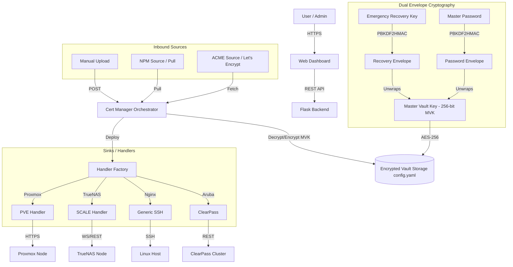

# System Architecture - CertAutomator

**Version**: 1.2.1
**Date**: 2026-08-10
**Author**: Systems Architecture Team

## 1. High-Level Design
CertAutomator 1.2.1 implements a modular **Source-Storage-Sink** architecture with **Dual-Envelope Cryptography** to handle the full lifecycle of SSL/TLS certificates.

```mermaid
graph TD
    User[User / Admin] -->|HTTPS| WebUI[Web Dashboard]
    WebUI -->|REST API| Flask[Flask Backend]
    
    subgraph Dual Envelope Cryptography
    Pass[Master Password] -->|PBKDF2HMAC| PE[Password Envelope]
    RecKey[Emergency Recovery Key] -->|PBKDF2HMAC| RE[Recovery Envelope]
    PE -->|Unwraps| MVK[Master Vault Key - 256-bit MVK]
    RE -->|Unwraps| MVK
    end

    MVK -->|AES-256| Storage[(Encrypted Vault Storage config.yaml)]

    subgraph Inbound Sources
    ACME[ACME Source / Let's Encrypt]
    NPM[NPM Source / Pull]
    UPLOAD[Manual Upload]
    end
    
    ACME -->|Fetch| Manager[Cert Manager Orchestrator]
    NPM -->|Pull| Manager
    UPLOAD -->|POST| Manager
    
    Manager -->|Decrypt/Encrypt MVK| Storage
    Manager -->|Deploy| Factory[Handler Factory]
    
    subgraph Sinks / Handlers
    Factory -->|Proxmox| H1[PVE Handler]
    Factory -->|TrueNAS| H2[SCALE Handler]
    Factory -->|Nginx| H3[Generic SSH]
    Factory -->|Aruba| H4[ClearPass]
    end
    
    H1 -->|HTTPS| Ext1[Proxmox Node]
    H2 -->|WS/REST| Ext2[TrueNAS Node]
    H3 -->|SSH| Ext3[Linux Host]
    H4 -->|REST| Ext4[ClearPass Cluster]
```

## 2. Dual-Envelope Cryptography Architecture
- **Master Vault Key (`MVK`)**: A 256-bit random secret that encrypts `config.yaml` and private keys (`privkey.enc`).
- **Password Envelope**: Wraps `MVK` using PBKDF2HMAC (SHA-256, 100,000 iterations) derived from the user's Master Password.
- **Recovery Envelope**: Wraps `MVK` using PBKDF2HMAC derived from the 32-character Emergency Recovery Key.
- **Zero Data Loss Recovery**: Recovering via `/api/recover` unwraps `MVK` using the Emergency Recovery Key and re-encrypts `MVK` with a new Master Password without wiping configurations or keys.

## 3. Technology Stack
- **Runtime**: Python 3.13 (Slim Bookworm)
- **Web Framework**: Flask 3.x (Gunicorn WSGI)
- **Security**: 
    - `cryptography` 50.0.0 (PBKDF2HMAC, Fernet AES-256)
    - `urllib3` 2.7.0 & `requests` 2.34.2
- **Transport**: 
    - `paramiko` (SSH/SCP)
    - `websocket-client` (TrueNAS SCALE JSON-RPC)
    - `acme` (Python ACME v2 Protocol)

## 4. Core Logic Flow (v1.2.1)
1.  **Authentication**: User provides password or recovery key to unlock `MVK`.
2.  **Legacy Auto-Migration**: Legacy single-password vaults are automatically migrated to Dual-Envelope mode on first login.
3.  **Collection**: Sources (ACME, NPM) check for updated certificates upstream.
4.  **Deduplication**: Serial number / SHA256 comparison against active certs in `/certs`.
5.  **Distribution**: Decrypts private keys using `MVK` and dispatches updates to configured sinks.

## 5. Security Framework
- **DoS Protection**: Mandatory timeouts on all external network IO.
- **Credential Protection**: All service tokens/passwords are Fernet-encrypted.
- **Privilege Separation**: App runs as `appuser:1000`. No root required for internal logic.

## 6. Deployment
- **Containerization**: Single Docker image supporting `dev`, `prod`, and `dist` profiles via volume mapping.
- **Persistence**: Relies on host-mounted volumes for `/app/certs`, `/app/backups`, `auth.json`, and `/app/config.yaml`.
